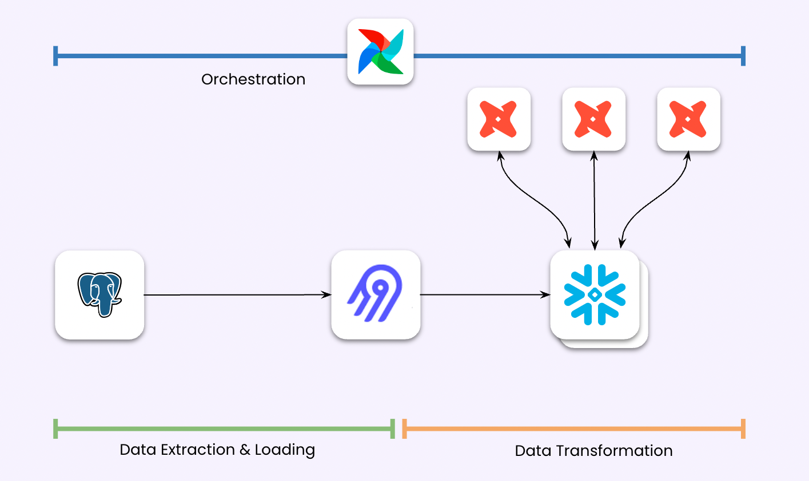

# Snowflake ELT

Welcome to my Snowflake ELT project!
This project is a data pipeline project that transfer data from PostgreSQL database to Snowflake data warehouse then transforms the data using DBT. 

## Prerequisites
You will need to have the following things:

- [Airbyte](https://docs.airbyte.com/category/airbyte-open-source-quick-start)
- [Apache Airflow](https://airflow.apache.org/)
- [DBT](https://docs.getdbt.com/docs/introduction)
- [PostgreSQL Database](https://www.elephantsql.com/) 
- [Snowflake Account](https://signup.snowflake.com/)

Here are the important files/directories you can use:

Directories/Files | Description 
------------- | -------------
`airflow-dags` | Contains Airflow DAG script that specifies the ELT pipeline workflow  
`models` | Contains DBT models, data-transformation flow & logic
`dbt_run.sh` | Shell script to trigger DBT from Airflow
`dataset` | Contains the data that used in the pipeline

